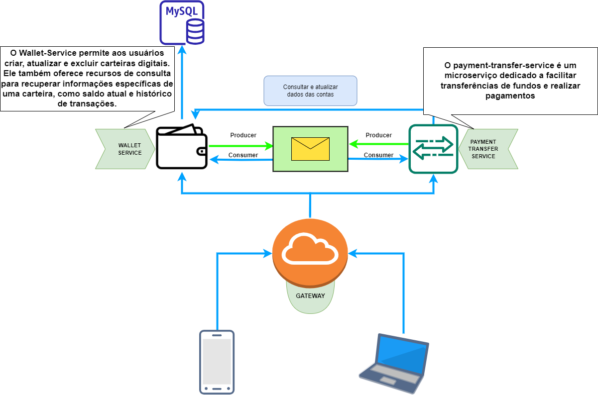

# payment-transfer-service 🏦💸

Este repositório contém o código-fonte e os recursos relacionados ao payment-transfer-service, um microserviço dedicado para transferências e pagamentos.

# Principal recurso 🚀
✨ Transferências e Pagamentos: O payment-transfer-service é um microserviço dedicado a facilitar transferências de fundos e realizar pagamentos

# Setup da aplicação (local)
## Pré-requisitos
Antes de executar a aplicação, certifique-se de ter as seguintes dependências instaladas corretamente em seu ambiente de desenvolvimento:

- Java 17
- Maven 3.9.2
- RabbitMQ 3.11.5

**Observação:** Para fins de avaliação ou execução em um ambiente local de teste, o projeto já está configurado com **RabbitMQ**. No entanto, se você deseja usar seu próprio **RabbitMQ**, siga as seguintes instruções:

### RabbitMQ
No arquivo de configuração  `application.yml`, adicione as seguintes configurações para o RabbitMQ:

```yaml
spring:
  rabbitmq:
    host: seu_host
    port: sua_porta
    username: seu_usuario
    password: sua_senha
```

Certifique-se de substituir `seu_host`, `sua_porta`, `seu_usuario` e `sua_senha` pelas informações corretas do seu servidor RabbitMQ.

## Instalação e execução da aplicação

**1. Clone o repositório:**
```
git clone git@github.com:Geovane33/payment-transfer-service.git
```

**2. Acesse o diretório do projeto:**
```
cd payment-transfer-service
```

**3. Caso não tenha executado o serviço exteno [wallet-service](https://github.com/Geovane33/wallet-service) execute e caso tenha alterado a url padrão(localhost:8080), informe a url de serviço exteno wallet-service no application.yml.**

**4. Compile o código e baixe as dependências do projeto:**
```
mvn clean package
```
**5. Inicie a aplicação:**
```
mvn spring-boot:run
```

- Após executar esses passos, a aplicação estará disponível em http://localhost:8081.
- Acesse a documentação da API em http://localhost:8081/swagger-ui/index.html para obter mais detalhes sobre os endpoints disponíveis.

# Setup da aplicação usando Docker
Antes de executar a aplicação, considerando que o projeto ja vem com RabbitMQ configurados, certifique-se de ter as seguintes dependências instaladas corretamente em seu ambiente:

- Java 17
- Docker 24.0.2
- Maven 3.9.2

**1. Clone o repositório:**
```
git clone git@github.com:Geovane33/payment-transfer-service.git
```

**2. Acesse o diretório do projeto:**
```
cd payment-transfer-service
```
**3. Informar a url de serviço exteno `wallet-service` no `application.yml`** 

**4. Compile o código e baixe as dependências do projeto:**
```
mvn clean package
```

**5. Construa a imagem Docker:**
```
docker build -t payment-transfer-service .
```

**6. O serviço faz comunicação com [wallet-service](https://github.com/Geovane33/wallet-service) então caso não tenha criado, crie uma rede para conectar os containers:**
```
docker network create local
```

**7. Execute o contêiner Docker conectado à rede local:**
```
docker run -d -p 8081:8081 --network local --name payment-transfer-service payment-transfer-service
```
- A opção `-p 8081:8081` mapeia a porta 8081 do contêiner para a porta 8081 do host. Você pode alterar a porta do host, se desejar.
- O parâmetro `--network local` conecta o contêiner à rede local que foi criada.
- O parâmetro `--name payment-transfer-service` define o nome do contêiner como "payment-transfer-service". Você pode escolher um nome diferente, se desejar.

- Após executar esses passos, a aplicação estará disponível em http://localhost:8081.
- Acesse a documentação da API em http://localhost:8081/swagger-ui/index.html para obter mais detalhes sobre os endpoints disponíveis.




Este repositório não armezena somente códigos desse projeto, ele armazena determinação, noites em claro, muito aprendizado e expectativas que, por vezes, foram frustradas!! Mas eu sei que cada linha representa uma jornada repleta de desafios e superações. Este repositório é mais do que uma simples coleção de arquivos, é uma história de crescimento, evolução e o reflexo do poder de nunca desistir diante das adversidades.
